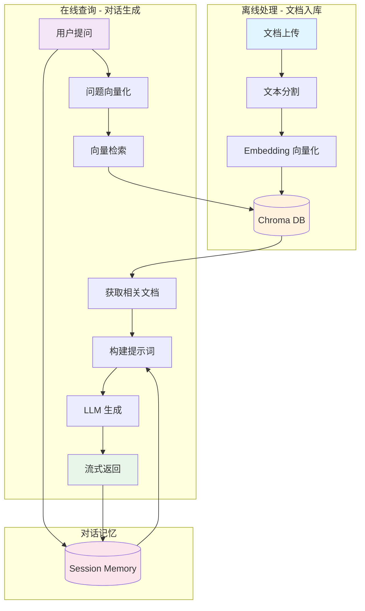

# RAG Chatbot with Apple Glass UI

基于 LangChain 的 RAG（检索增强生成）聊天助手，采用 Apple 风格毛玻璃设计。

## 架构说明

```
├── backend/                 # FastAPI 后端
│   ├── app/
│   │   ├── config.py        # 配置管理
│   │   ├── embeddings.py    # Embedding 封装
│   │   ├── vectorstore.py   # Chroma 向量数据库
│   │   ├── chain.py         # RAG 链
│   │   ├── memory.py        # 对话记忆
│   │   ├── models.py        # 数据模型
│   │   └── main.py          # FastAPI 主应用
│   ├── requirements.txt
│   └── .env
│
├── frontend/                # React 前端
│   ├── src/
│   │   ├── components/      # UI 组件
│   │   ├── hooks/           # 自定义 Hooks
│   │   ├── App.tsx
│   │   └── index.css
│   ├── package.json
│   └── vite.config.ts
│
└── README.md
```

## UI 设计理念

采用 **Apple 风格毛玻璃（Glassmorphism）** 设计：

- **半透明背景**: `bg-white/10` 配合 `backdrop-blur-xl`
- **柔和边框**: `border-white/20`
- **动态渐变**: 流动背景动画
- **粒子效果**: Canvas 粒子连线动画
- **深色主题**: 默认深色模式

## 动效实现

- **渐变背景**: `animation: gradient 15s ease infinite`
- **漂浮元素**: `animate-float` 配合 blur
- **粒子系统**: Canvas 绘制连线粒子
- **消息动画**: `animate-slide-up` 淡入滑动
- **流式显示**: 实时渲染 AI 回复

## RAG 工作流程



### 流程说明

| 阶段 | 步骤 | 说明 |
|------|------|------|
| 离线处理 | 文档上传 | 支持 PDF、TXT 文件上传 |
| | 文本分割 | RecursiveCharacterTextSplitter |
| | 向量化 | SiliconFlow Embedding API |
| | 存储 | Chroma 本地向量数据库 |
| 在线查询 | 向量检索 | 相似度搜索 Top-K |
| | 提示构建 | 结合上下文 + 对话历史 |
| | LLM 生成 | 基于上下文的回答生成 |

## 如何运行

### 后端

```bash
cd backend

# 创建虚拟环境
python -m venv venv
source venv/bin/activate  # Windows: venv\Scripts\activate

# 安装依赖
pip install -r requirements.txt

# 配置环境变量 (已预设 SiliconFlow API)
# 编辑 .env 文件

# 运行服务
uvicorn app.main:app --reload --host 0.0.0.0 --port 8000
```

### 前端

```bash
cd frontend

# 安装依赖
npm install

# 开发模式
npm run dev

# 构建
npm run build
```

### 访问

- 前端: http://localhost:3000
- 后端 API: http://localhost:8000
- API 文档: http://localhost:8000/docs

## API 接口

| 方法 | 路径 | 说明 |
|------|------|------|
| GET | /health | 健康检查 |
| POST | /chat | 发送消息 |
| POST | /chat/stream | 流式消息 |
| POST | /ingest | 导入文本 |
| POST | /ingest/file | 导入文件 |
| GET | /sessions | 获取会话列表 |
| DELETE | /sessions/{id} | 清除会话 |

## 如何扩展

### 更换 LLM 模型

编辑 `backend/.env`:
```
LLM_MODEL=deepseek-ai/DeepSeek-V3
```

### 更换向量数据库

修改 `backend/app/vectorstore.py`，替换 Chroma 为 Qdrant、Pinecone 等。

### 添加文件类型支持

在 `backend/app/main.py` 的 `ingest_file` 函数中添加新的解析逻辑。

### 自定义 Prompt

修改 `backend/app/chain.py` 中的 `PROMPT_TEMPLATE`。

## 技术栈

**后端**
- FastAPI
- LangChain
- Chroma DB
- SiliconFlow API (OpenAI 兼容)

**前端**
- React 18
- TypeScript
- TailwindCSS
- Vite
- Lucide Icons

## License

MIT
