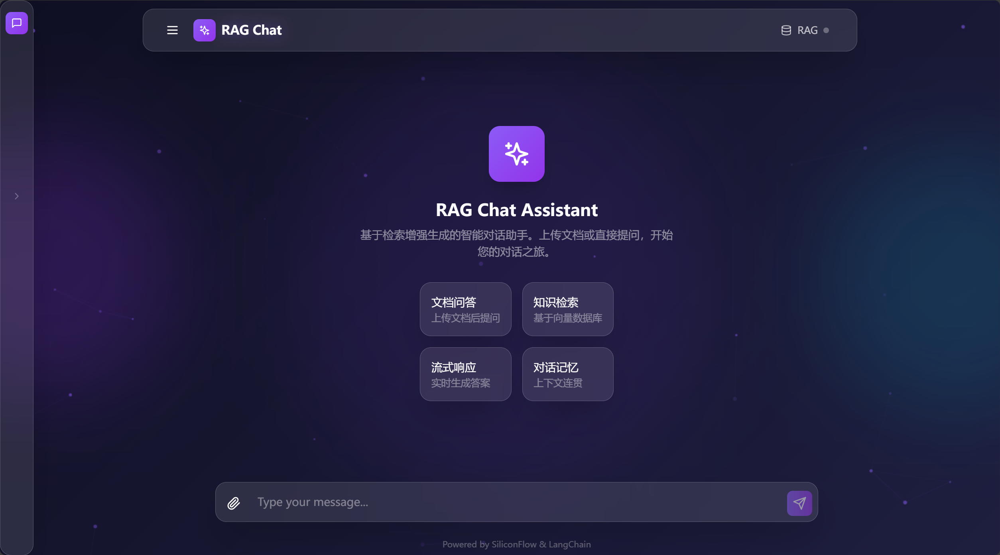
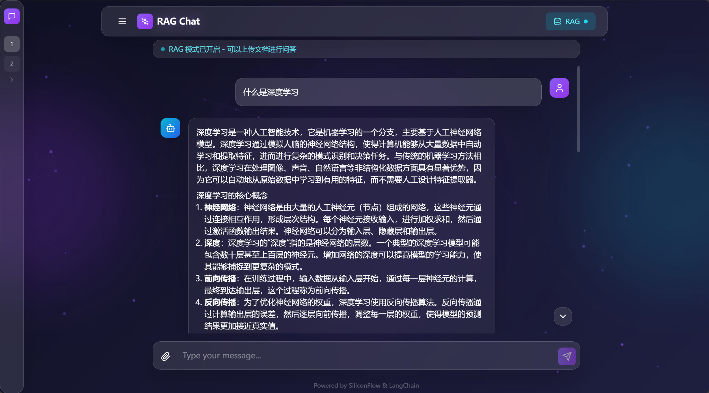
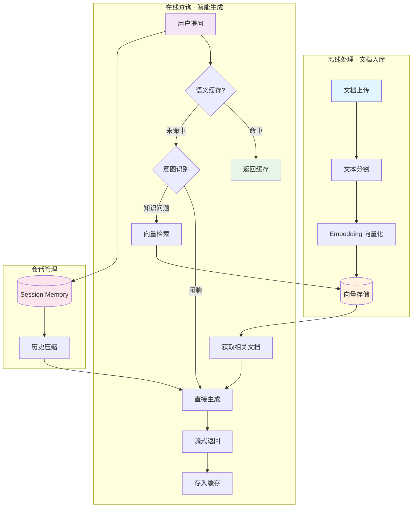

# RAG Chat

基于 LangChain 的 RAG（检索增强生成）聊天助手





## 特性亮点

- 🤖 **智能RAG**：意图识别自动判断是否检索，闲聊直接回答，知识问题检索文档
- ⚡ **语义缓存**：相似查询自动命中缓存，节省 80%+ API 费用
- 🗜️ **历史压缩**：长对话自动压缩早期历史，保持上下文连贯
- 📄 **多会话管理**：持久化存储，自动命名（≤10字），侧边栏快速切换
- 🎨 **毛玻璃 UI**：Apple 风格设计，鼠标悬停展开侧边栏

## 架构说明

```
├── backend/                 # FastAPI 后端
│   ├── app/
│   │   ├── config.py              # 配置管理
│   │   ├── models.py              # Pydantic 数据模型
│   │   ├── main.py                # FastAPI 主应用
│   │   ├── chain.py               # 聊天逻辑（流式输出）
│   │   ├── rag_manager.py         # RAG 管理器（开关控制）
│   │   ├── session_manager.py     # 会话持久化管理
│   │   ├── semantic_cache.py      # 语义缓存
│   │   ├── intent_classifier.py   # 意图识别
│   │   ├── conversation_compressor.py  # 对话历史压缩
│   │   ├── embeddings.py          # Embedding 封装
│   │   └── vectorstore.py         # 简单向量存储
│   ├── .env                       # API 配置
│   └── requirements.txt
│
├── frontend/                # React 前端
│   ├── src/
│   │   ├── components/            # UI 组件
│   │   │   ├── Sidebar.tsx        # 会话列表侧边栏（悬停展开）
│   │   │   ├── Navbar.tsx         # 导航栏
│   │   │   ├── ChatWindow.tsx     # 聊天窗口
│   │   │   ├── MessageBubble.tsx  # 消息气泡
│   │   │   └── InputBox.tsx       # 输入框
│   │   ├── hooks/                 # 自定义 Hooks
│   │   │   ├── useChat.ts         # 聊天管理
│   │   │   ├── useSessions.ts     # 会话管理
│   │   │   └── useRAG.ts          # RAG 状态
│   │   ├── App.tsx
│   │   └── index.css
│   └── package.json
│
├── backend/sessions.json    # 会话数据（持久化）
└── README.md
```

## RAG 工作流程



### 流程说明

| 阶段 | 步骤 | 说明 |
|------|------|------|
| 缓存检查 | 语义匹配 | 相似度 > 0.92 直接返回缓存 |
| 意图识别 | 规则+LLM | 闲聊直接回答，知识问题检索 |
| 向量检索 | Top-K 搜索 | 相似度排序，获取相关文档 |
| 历史压缩 | 智能摘要 | 长对话自动压缩早期历史 |
| 流式生成 | SSE 推送 | 实时逐字显示 AI 回复 |

## 优化特性详解

### 1. 意图识别 (Intent Classification)

自动判断用户问题是否需要检索文档：
- **闲聊类**：问候、感谢、简单问答 → 直接回答，不检索
- **知识类**："什么是"、"为什么"、"怎么做" → 检索文档后回答

```python
# 规则匹配 + LLM 判断
if "你好" in query:
    return "chat"  # 闲聊模式
else:
    return llm_classify(query)  # LLM 判断
```

### 2. 语义缓存 (Semantic Cache)

缓存相似查询，避免重复调用 API：
- 使用 Embedding 计算余弦相似度
- 相似度阈值：0.92
- LRU 淘汰策略，最大 100 条缓存
- **效果**：相同/相似问题响应时间 < 100ms，节省 80%+ API 费用

### 3. 对话历史压缩 (Conversation Compressor)

长对话时自动压缩早期历史：
- 超过 10 条消息或 500 tokens 时触发
- 早期对话生成摘要（≤100字）
- 保留最近 2 轮完整对话
- **效果**：降低 token 消耗，保持上下文连贯

### 4. 多会话管理

- **持久化存储**：会话数据保存到 `backend/sessions.json`
- **自动命名**：首次对话后使用 DeepSeek-V3 生成会话名（≤10字）
- **侧边栏交互**：
  - 桌面端：鼠标悬停左侧边缘自动展开
  - 移动端：点击菜单按钮展开
  - 支持新建、删除、切换会话

## 如何运行

### 后端

```bash
cd backend

# 使用 .conda 环境的 Python
.conda/python.exe -m pip install -r requirements.txt

# 运行服务
.conda/python.exe -m uvicorn app.main:app --reload --host 0.0.0.0 --port 8000
```

### 前端

```bash
cd frontend

# 安装依赖
npm install

# 开发模式
npm run dev

# 构建
npm run build
```

### 访问

- 前端: http://localhost:3000
- 后端 API: http://localhost:8000
- API 文档: http://localhost:8000/docs

## API 接口

### 聊天相关

| 方法 | 路径 | 说明 |
|------|------|------|
| POST | /chat | 发送消息（非流式） |
| POST | /chat/stream | 流式消息（SSE） |

### RAG 控制

| 方法 | 路径 | 说明 |
|------|------|------|
| GET | /rag/status | 查询 RAG 状态 |
| POST | /rag/enable | 开启 RAG |
| POST | /rag/disable | 关闭 RAG |

### 文档导入

| 方法 | 路径 | 说明 |
|------|------|------|
| POST | /ingest | 导入文本（需开启 RAG） |
| POST | /ingest/file | 导入文件（PDF/TXT） |

### 会话管理

| 方法 | 路径 | 说明 |
|------|------|------|
| GET | /sessions | 获取所有会话 |
| POST | /sessions | 创建新会话 |
| GET | /sessions/{id} | 获取单个会话 |
| DELETE | /sessions/{id} | 删除会话 |

## 如何扩展

### 更换 LLM 模型

编辑 `backend/.env`:
```bash
LLM_MODEL=deepseek-ai/DeepSeek-V3
```

### 调整缓存阈值

编辑 `backend/app/semantic_cache.py`:
```python
semantic_cache = SemanticCache(
    max_size=100,           # 最大缓存条数
    similarity_threshold=0.92  # 相似度阈值
)
```

### 自定义意图规则

编辑 `backend/app/intent_classifier.py`:
```python
CHITCHAT_PATTERNS = [
    r"^(你好|您好|嗨|hello|hi)",
    r"^(谢谢|感谢|thank)",
    # 添加你的规则
]
```

### 调整历史压缩触发条件

编辑 `backend/app/conversation_compressor.py`:
```python
compressor = ConversationCompressor(
    max_messages=10,      # 超过10条触发
    max_summary_tokens=500  # 或超过500 tokens
)
```

## 技术栈

**后端**
- FastAPI - 高性能 Web 框架
- LangChain - LLM 应用框架
- SiliconFlow API - 大模型服务（OpenAI 兼容）
- NumPy - 向量计算

**前端**
- React 18 - UI 框架
- TypeScript - 类型安全
- TailwindCSS - 原子化 CSS
- Vite - 构建工具
- Lucide Icons - 图标库

**优化技术**
- 语义缓存 - Embedding + 余弦相似度
- 意图识别 - 规则引擎 + LLM 分类
- 历史压缩 - 智能摘要生成
- 流式传输 - SSE (Server-Sent Events)

## License

MIT

## 更新日志

### v2.0 - 2026-02-14
- ✨ 新增意图识别，自动判断是否需要检索
- ✨ 新增语义缓存，节省 80%+ API 费用
- ✨ 新增对话历史压缩，支持长对话
- ✨ 新增多会话管理，持久化存储
- ✨ 新增侧边栏悬停展开交互
- ✨ 新增 RAG 功能开关
- 🎨 采用 Apple 毛玻璃设计风格
